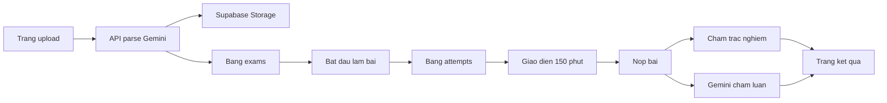

# Kế hoạch demo Ôn thi VB2CA

## Bối cảnh đã xác nhận

Workspace hiện gần như trống (chỉ có [dapanca1.txt](dapanca1.txt)). File `de-ca1.pdf` được mention nhưng **chưa nằm trong repo** — khi triển khai cần đặt vào `fixtures/de-ca1.pdf`.

File đáp án cho thấy đề **CA1 (Toán cao cấp)** không phải 50 câu ABCD thuần:

- Câu 1–45: A/B/C/D
- Câu 46–50: điền số (`72`, `0`, `19`, `403`, `8`)

Cấu trúc chính thức VB2CA: **150 phút**, thang **100** = tự luận **30** + trắc nghiệm **70**.

## Đề xuất cắt phạm vi để demo chạy được (quan trọng)

Những thay đổi này nhằm tránh chết ở OCR, timeout Vercel, và parse toán. Vẫn đúng luồng chính user mô tả.

1. **Không dùng Cloud Vision OCR + Vertex AI.** Gemini 2.5 Flash đọc PDF trực tiếp (Google AI Studio, API key). User gọi “Google Cloud Studio” — bản demo dùng [Google AI Studio](https://aistudio.google.com), không dùng Google Cloud Vision.
2. **Không đăng nhập v1.** Làm bài ẩn danh qua `attemptId`. Auth/lịch sử user để sau.
3. **Phần 2 hỗ trợ 2 loại câu:** `mcq` (4 lựa chọn) và `numeric` (ô nhập số). Không ép 50 câu thành ABCD.
4. **Đảo đề:** xáo thứ tự 50 câu; với MCQ đảo thứ tự đáp án rồi gán lại A/B/C/D. Câu điền số không có lựa chọn nên chỉ đảo vị trí câu.
5. **Thang điểm cố định:** tự luận 30 (Gemini chấm theo rubric), 50 câu chia đều 70 điểm (1.4đ/câu, đúng/sai). Câu số so khớp nguyên (trim).
6. **Upload 1 lần → lưu đề vào Supabase → làm bài.** Parse PDF chậm (~20–60s); không parse lại mỗi lần thi. Có **đề mẫu CA1 đã parse sẵn** (`fixtures/`) để demo vẫn chạy nếu Gemini timeout.
7. **Sau parse hiện màn xem trước** (đề bài luận + 3 câu đầu). Không cho sửa tay ở v1; sai thì upload lại.
8. **Ngoài v1:** tài khoản, CA2/CA3/CA4, chống gian lận, dashboard admin, sửa đề tay, lịch sử nhiều user.

## Kiến trúc



**Stack (chọn vì khớp Vercel + BaaS, ít glue code):**

- Next.js (App Router) + TypeScript + Tailwind + shadcn/ui
- Supabase: Postgres + Storage (file đề/đáp án). Mọi ghi DB đi qua Route Handler với **service role** (không expose write từ browser)
- Gemini 2.5 Flash qua `@ai-sdk/google` + `generateObject` (JSON có schema)
- Deploy: GitHub → Vercel. Route parse/chấm đặt `maxDuration = 60`

## Luồng sản phẩm v1

**Trang 1 — `/`:** form 2 file (PDF đề, TXT đáp án) + nút “Dùng đề mẫu CA1”.

**Trang 2 — `/exams/[id]`:** xem trước đề đã parse, nút “Bắt đầu (150 phút)”. Tạo `attempts` với `started_at`, permutation câu, map đảo đáp án.

**Trang 3 — `/attempts/[id]`:**

- Đồng hồ đếm ngược từ `started_at + 150p` (server là nguồn sự thật; client chỉ hiển thị)
- Phần 1: đề nghị luận + textarea
- Phần 2: 50 câu (radio A–D hoặc input số), công thức render KaTeX
- Tự lưu mỗi 30s vào `attempts.answers` + `essay_text`
- Hết giờ hoặc bấm Nộp → khóa bài

**Trang 4 — `/attempts/[id]/result`:** điểm luận /30 + nhận xét AI, điểm TN /70 (số câu đúng), tổng /100, list câu đúng/sai (đáp án user vs đáp án đúng theo thứ tự đã đảo).

## Parse Gemini (thay OCR)

Gửi PDF (inline/`fileData`) + nội dung TXT đáp án. Bắt JSON:

```ts
{
  essayPrompt: string
  questions: Array<{
    originalNumber: number
    type: "mcq" | "numeric"
    stem: string          // Markdown + LaTeX $...$
    options?: { A: string; B: string; C: string; D: string }
  }>
}
```

Đáp án TXT parse bằng regex (`^(\d+)\s+([A-D]|-?\d+)$`), không nhờ AI — file [dapanca1.txt](dapanca1.txt) đã đủ sạch. Ghép `originalNumber` với answer key. Nếu không đủ 50 câu hoặc thiếu key → trả lỗi rõ, không bắt đầu thi.

Prompt parse yêu cầu giữ nguyên công thức Toán (ma trận, định thức) dạng LaTeX — đây là rủi ro lớn nhất của CA1.

## Schema Supabase (tối thiểu)

- `exams`: `id`, `title`, `essay_prompt`, `questions jsonb`, `answer_key jsonb`, `pdf_path`, `answer_path`, `created_at`
- `attempts`: `id`, `exam_id`, `shuffle jsonb`, `started_at`, `submitted_at`, `essay_text`, `answers jsonb`, `essay_score`, `essay_feedback`, `mcq_score`, `mcq_detail jsonb`, `total_score`
- Bucket `exam-uploads` (private)

RLS: deny all từ `anon`; chỉ server dùng service role.

## Chấm điểm

- TN: so `answers[shuffledId]` với key đã remap theo `shuffle`. 1.4đ/câu đúng.
- Luận: `generateObject` rubric ngắn (ý, lập luận, bố cục, ngôn ngữ) → `{ score: 0-30, feedback }`.
- Tổng = luận + TN, làm tròn 1 chữ số thập phân.

## Env và deploy

`.env.local` / Vercel env:

- `NEXT_PUBLIC_SUPABASE_URL`
- `SUPABASE_SERVICE_ROLE_KEY` (server only)
- `GEMINI_API_KEY` (từ AI Studio, không commit)

Repo GitHub → Vercel project, bind `0.0.0.0` không cần vì Next.js trên Vercel tự xử lý PORT. Sau khi có schema, chạy SQL trên Supabase Dashboard (hoặc `supabase/migrations`).

## Việc cần user chuẩn bị trước khi code

- File `de-ca1.pdf` vào workspace
- Tài khoản Google AI Studio + API key
- Project Supabase (free)
- Repo GitHub trống (hoặc dùng repo hiện tại) để Vercel deploy
