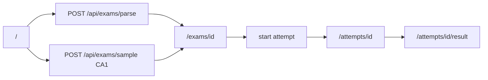
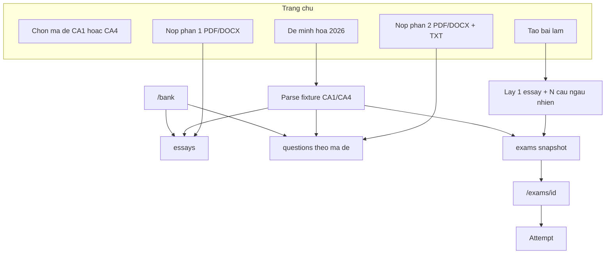

# VB2CA v2 — Ngân hàng câu hỏi và nhận diện thương hiệu

## Hiện trạng v1 (điểm neo)

App hiện tạo **một đề khép kín** mỗi lần upload: Gemini đọc PDF, ghép TXT đáp án, lưu JSONB vào `exams`, rồi xáo câu khi bắt đầu attempt. Không có ngân hàng câu hỏi, không có CA4, logo chưa dùng, màu primary gần đen.

Luồng hiện tại:



Ba phát hiện ảnh hưởng thiết kế v2:

- CA1 (`fixtures/dapanca1.txt`): 50 câu = 45 trắc nghiệm A–D + 5 điền số (46–50).
- CA4 (`fixtures/dapanca4.txt`): 60 câu = 54 trắc nghiệm A–D + **6 điền chữ** (55–60, ví dụ “Năng lực pháp luật”). Parser hiện tại (`LINE_RE` chỉ nhận A–D hoặc số) **sẽ bỏ qua** 6 câu này; `EXPECTED_QUESTION_COUNT = 50` cũng không khớp.
- Trang kết quả đã render LaTeX ở **stem** nhưng **không** render ở đáp án/lựa chọn — đây là bug format toán mà user mô tả:

```90:104:components/results-view.tsx
              {item.type === "mcq" && item.options
                ? OPTION_LETTERS.map((letter) => (
                    <p key={letter} className={...}>
                      {letter}. {item.options?.[letter]}
                    </p>
                  ))
                : null}
```

---

## Các lựa chọn thiết kế đã chốt

Các quyết định dưới đây được chọn để khớp đề thật, giữ attempt ổn định, và tách hồ sơ đóng góp khỏi hồ sơ làm bài.

**1. Tách “đóng góp ngân hàng” khỏi “tạo bài làm”**

- Trang chủ không còn upload-để-thi.
- Upload PDF/DOCX (+ TXT) **chỉ nạp vào ngân hàng**.
- Nút **Tạo bài làm** lấy ngẫu nhiên từ ngân hàng theo mã đề đã chọn.
- Nút **Dùng đề minh họa 2026** tạo đề **cố định** từ fixture (không random), theo đúng mã đề đang chọn.

**2. Hai kho độc lập, nạp độc lập**

| Kho | Phạm vi | File | Dedup |
|---|---|---|---|
| Phần 1 nghị luận | Dùng chung CA1 và CA4 | PDF hoặc DOCX | Theo nội dung đề bài |
| Phần 2 trắc nghiệm / điền | Theo `exam_code` CA1 hoặc CA4 | PDF/DOCX câu hỏi + TXT đáp án | Theo nội dung câu + mã đề |

Người dùng có thể chỉ nạp phần 1, hoặc chỉ nạp phần 2. Phần nào trùng thì loại, phần nào mới thì giữ.

**3. Cấu trúc đề khi assemble (bám đề thật)**

- CA1: 1 câu NLXH + 45 MCQ + 5 điền (tổng 50, 70 điểm phần 2 → 1.4đ/câu).
- CA4: 1 câu NLXH + 54 MCQ + 6 điền (tổng 60, 70 điểm phần 2 → ~1.17đ/câu).
- Thang điểm giữ **30 + 70 = 100**, 150 phút.
- Nếu ngân hàng thiếu so với định mức: vẫn tạo đề với số câu hiện có, cảnh báo trên preview; chặn chỉ khi **không có NLXH** hoặc **không có câu phần 2** của mã đó.
- Điểm/câu = `70 / số câu phần 2 của đề đó` (không hardcode 1.4).

**4. Thứ tự câu trên trang làm bài**

- Xáo **riêng** nhóm MCQ và nhóm điền; **luôn đặt điền ở cuối**.
- Đổi nhãn “Điền số” → “Điền đáp án” (CA4 là chữ, CA1 là số).
- Type nội bộ: giữ `"mcq"`; đổi `"numeric"` → `"fill"` (vẫn chấp nhận alias `"numeric"` khi đọc JSON cũ).

**5. Dedup hai lớp**

1. **Vân tay chính xác:** chuẩn hóa (lowercase, gộp khoảng trắng, bỏ dấu câu thừa) rồi `sha256`. Essay: hash prompt. MCQ: hash `exam_code + stem + 4 lựa chọn đã sort`. Fill: hash `exam_code + stem`.
2. **Gần trùng:** so Jaccard token với câu cùng mã; nếu > 0.55 thì hỏi Gemini “có cùng một câu không?”. Trùng → loại.

**6. Exam đã tạo là snapshot**

Bảng `exams` / `attempts` giữ nguyên ý: đề đã assemble là bản đóng băng (JSONB questions + answer_key). Xóa/sửa ngân hàng sau này **không** làm hỏng bài đang làm hoặc đã nộp.

**7. Auth**

Không thêm đăng nhập ở v2 (giống v1). Đóng góp mở, dựa vào dedup + validate file. Auth để sau nếu ngân hàng bị spam.

**8. Đề minh họa 2026**

- CA1 → `fixtures/de-ca1.pdf` + `dapanca1.txt`.
- CA4 → `fixtures/de-ca4.pdf` + `dapanca4.txt`.
- Lần đầu dùng (hoặc seed khi nạp ngân hàng trống) cũng **đưa các câu fixture vào ngân hàng** (qua cùng pipeline dedup), để trang ngân hàng không rỗng.

---

## Mô hình dữ liệu mới

Migration mới `supabase/migrations/002_question_bank.sql` (không phá `exams`/`attempts` hiện có):

```sql
-- essays: phần 1 dùng chung
essays (id, prompt, fingerprint unique, source_filename, created_at)

-- questions: phần 2 theo mã đề
questions (
  id, exam_code 'CA1'|'CA4', type 'mcq'|'fill',
  stem, options jsonb, answer text,
  fingerprint, unique(exam_code, fingerprint), created_at
)

-- exams: thêm mã đề + nguồn tạo
alter exams add exam_code text, add source 'random'|'sample';
```

Storage bucket `exam-uploads`: mở MIME `docx` (`application/vnd.openxmlformats-officedocument.wordprocessingml.document`).

`originalNumber` trên exam snapshot = số thứ tự **trong đề đã ghép** (1..N), không phải id ngân hàng.

---

## Luồng v2



API mới / chỉnh:

| API | Vai trò |
|---|---|
| `POST /api/bank/essays` | Nạp phần 1, trả `{ added, skipped }` |
| `POST /api/bank/questions` | Nạp phần 2 theo `examCode`, trả `{ added, skipped }` |
| `POST /api/exams/generate` | Body `{ examCode }` → assemble random → `{ examId }` |
| `POST /api/exams/sample` | Body `{ examCode }` → đề minh họa 2026 |
| `GET /bank` | Trang ngân hàng (server component) |
| `POST /api/exams/parse` | **Gỡ khỏi homepage**; có thể xóa hoặc giữ nội bộ |

---

## Giao diện

**Thương hiệu** — [`app/globals.css`](app/globals.css), [`app/layout.tsx`](app/layout.tsx), [`components/site-header.tsx`](components/site-header.tsx)

- Primary `#245832` (các token `--primary`, `--ring`, `--sidebar-primary`).
- Header: `logo.svg` bo góc (`rounded-lg` / `rounded-xl`), bỏ badge chữ “CA”.
- Favicon / tab: `logo.png` qua metadata `icons` (Next đọc `app/icon.png` hoặc `metadata.icons`). Cũng bo góc bằng CSS trên header; file tab dùng PNG gốc.
- Times New Roman **chỉ** nội dung đề trên trang làm bài (stem, lựa chọn, đề NLXH) — class kiểu `font-[Times_New_Roman,Times,serif]`. UI (nút, timer, header) giữ Geist. Linux/Render fallback `Times, serif`.

**Trang chủ** — thay [`components/upload-form.tsx`](components/upload-form.tsx)

- Chọn mã đề CA1 / CA4 (segmented control).
- Hai nút hành động: Tạo bài làm / Dùng đề minh họa 2026.
- Khối đóng góp tách 2 form độc lập (Phần 1 / Phần 2), hiển thị kết quả `added/skipped`.
- Nav header thêm link **Ngân hàng câu hỏi**.

**Trang ngân hàng `/bank`**

- Tab: Nghị luận | CA1 | CA4.
- Mỗi câu: id ngắn, stem, options (nếu MCQ), đáp án — tất cả qua `MathText`.
- Badge loại câu (Trắc nghiệm / Điền đáp án).

**Trang làm bài** — [`components/exam-taker.tsx`](components/exam-taker.tsx)

- Font Times cho khối đề.
- Điền đáp án ở cuối; tiêu đề phần 2 theo số câu thực tế (50 hoặc 60).
- Ô điền rộng hơn cho đáp án chữ CA4.

**Trang kết quả** — [`components/results-view.tsx`](components/results-view.tsx)

- Bọc lựa chọn A–D và đáp án điền bằng `MathText` (sửa bug LaTeX).
- Điểm phần 2 lấy `70` cố định, không hardcode “50 câu”.

---

## Thay đổi parse / chấm

- [`lib/exam/parse-answers.ts`](lib/exam/parse-answers.ts): dòng `N <phần còn lại>`. A–D → MCQ; còn lại (số hoặc chữ) → fill. **Không** bắt buộc đủ 50 câu khi nạp ngân hàng — nhận từng câu có cặp hỏi–đáp.
- [`lib/exam/parse-pdf.ts`](lib/exam/parse-pdf.ts): tách prompt theo mục đích:
  - Parse **toàn đề minh họa** (essay + questions, số câu theo mã).
  - Parse **chỉ essay**.
  - Parse **chỉ phần 2** (không giả định 50 câu, không hardcode “mã CA1”).
- DOCX: thêm `mammoth` → HTML/text → Gemini. PDF giữ `type: "file"` như hiện tại.
- [`lib/exam/shuffle.ts`](lib/exam/shuffle.ts): xáo trong nhóm, concat MCQ rồi fill.
- [`lib/exam/grade.ts`](lib/exam/grade.ts): fill số giữ so sánh số; fill chữ so sánh không phân biệt hoa thường + gộp khoảng trắng, **giữ dấu tiếng Việt**. `POINTS_PER_QUESTION` truyền theo đề.

Hằng số mới trong [`lib/exam/constants.ts`](lib/exam/constants.ts):

```ts
EXAM_SPECS = {
  CA1: { mcq: 45, fill: 5, total: 50 },
  CA4: { mcq: 54, fill: 6, total: 60 },
}
SAMPLE_TITLES = {
  CA1: "Đề minh họa 2026 — CA1",
  CA4: "Đề minh họa 2026 — CA4",
}
```

---

## Thứ tự triển khai (4 pha)

Pha 1 có thể ship riêng, không đụng schema. Pha 2–4 phụ thuộc nhau.

**Pha 1 — Nhận diện + sửa lỗi làm bài (không đổi kiến trúc)**

- Theme `#245832`, logo header + favicon, Times trên trang làm bài.
- `MathText` cho đáp án/lựa chọn ở kết quả.
- Đưa câu `fill` xuống cuối khi hiển thị (đổi `createShuffle`).
- Sample nhận `examCode`; wire CA4; nới parser đáp án (chữ + số câu ≠ 50).

**Pha 2 — Schema ngân hàng + trang `/bank`**

- Migration `essays` / `questions`, cột `exams.exam_code` / `source`.
- Trang ngân hàng đọc DB (ban đầu có thể trống hoặc sau khi seed fixture).

**Pha 3 — Đóng góp vào ngân hàng**

- Form phần 1 / phần 2 trên homepage.
- API extract + dedup + insert.
- Seed fixture vào ngân hàng khi còn trống.

**Pha 4 — Tạo bài từ ngân hàng**

- `POST /api/exams/generate`: 1 essay ngẫu nhiên + sample theo định mức mã đề.
- Nút Tạo bài làm → preview `/exams/[id]` như cũ.
- Bỏ/ẩn flow parse-một-đề-rồi-thi trên homepage.

---

## Phạm vi không làm ở v2

- Đăng nhập, phân quyền sửa/xóa câu.
- Sửa tay câu trong ngân hàng.
- Lịch sử bài làm của user.
- Đổi rubric tự luận / thời gian thi.
