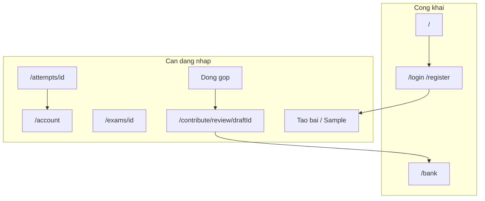
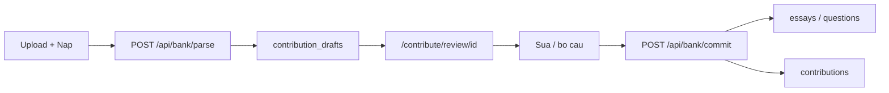

# VB2CA v3 — Review đóng góp và cá nhân hóa

## Hiện trạng v2 (điểm neo)

- Header vẫn trỏ [`/logo.svg`](components/site-header.tsx) (file đã xóa). Favicon đã dùng [`/logo.png`](app/layout.tsx).
- Nội dung đề trên trang làm bài / preview / kết quả gần như toàn bộ `text-sm` (~14px) + `font-exam`.
- Link **Ngân hàng câu hỏi** là text muted, không giống nút.
- Đóng góp: upload → OCR Gemini → **insert thẳng** vào `essays` / `questions` ([`app/api/bank/essays/route.ts`](app/api/bank/essays/route.ts), [`app/api/bank/questions/route.ts`](app/api/bank/questions/route.ts)). Chỉ có banner `added/skipped` hoặc một dòng lỗi.
- **Không có auth.** Mọi API dùng [`getSupabaseAdmin()`](lib/supabase/admin.ts). Attempt chỉ truy cập bằng UUID. v2 đã ghi rõ auth để sau.

Quyết định đã chốt: **bắt buộc đăng nhập** mới tạo bài, làm bài, và đóng góp. Khách vẫn xem trang chủ và `/bank`.



Auth dùng **Supabase Auth** (cùng project DB/Storage sẵn có), thêm `@supabase/ssr`. Next.js 16: file chặn session là [`proxy.ts`](https://nextjs.org/docs/app/api-reference/file-conventions/proxy) ở root (không dùng `middleware.ts`).

---

## Pha 1 — Giao diện nhỏ (không đụng schema)

**Logo trên thanh (header + tab)**

- [`components/site-header.tsx`](components/site-header.tsx): `src="/logo.svg"` → `src="/logo.png"`, giữ `rounded-lg object-cover`.
- Favicon đã là `/logo.png`; đồng bộ [`app/icon.png`](app/icon.png) với `public/logo.png` nếu khác nhau, để tab trình duyệt không lệch.

**Chữ đề to hơn**

Đổi nội dung đề (stem, lựa chọn A–D, đề nghị luận, đoạn thông tin cụm, ô điền) từ `text-sm leading-7` → **`text-lg leading-8`** trên:

- [`components/exam-taker.tsx`](components/exam-taker.tsx) (kể cả `CardTitle` câu, textarea nghị luận)
- [`app/exams/[id]/page.tsx`](app/exams/[id]/page.tsx)
- [`components/results-view.tsx`](components/results-view.tsx)

UI (timer, nút, mục lục) giữ size hiện tại. Times New Roman (`font-exam`) không đổi.

**Nút Ngân hàng câu hỏi**

Trong header, bọc bằng `Button variant="outline" size="sm" asChild`:

```tsx
<Button variant="outline" size="sm" asChild>
  <Link href="/bank">Ngân hàng câu hỏi</Link>
</Button>
```

Header cũng sẽ thêm Đăng nhập / avatar (Pha 3).

---

## Pha 2 — Đóng góp: ví dụ format, trang review, lỗi trực quan

### 2.1 Ví dụ format từng file

Trong [`components/contribute-panel.tsx`](components/contribute-panel.tsx), mỗi ô upload có khối **Xem ví dụ format** (collapse), không chỉ một dòng hint.

| File | Người dùng cần thấy |
|---|---|
| Đề nghị luận PDF/DOCX | Chỉ Phần 1; nhiều đề thì hệ thống tách bằng `---`; không lẫn trắc nghiệm. |
| Câu hỏi phần 2 PDF/DOCX | Số thứ tự, MCQ A–D, cụm đọc hiểu/tình huống 3 câu, câu điền ở cuối. |
| Đáp án TXT | Mỗi dòng `số + đáp án`: `1 A`, `46 72`, `55 Năng lực pháp luật`. Nút tải file mẫu từ [`fixtures/dapanca1.txt`](fixtures/dapanca1.txt) / [`fixtures/dapanca4.txt`](fixtures/dapanca4.txt) (copy ra `public/samples/`). |

Kèm checklist ngắn: encoding UTF-8 cho TXT, không scan ảnh thuần nếu không phải PDF chữ, kích thước file.

### 2.2 Tách OCR và nạp — trang review bắt buộc

Luồng mới (không insert khi OCR):



- Nút **Nạp vào ngân hàng** chỉ gọi parse (busy: “Đang trích xuất…”), lưu draft ~2 giờ, redirect `/contribute/review/[id]`.
- Trang review: danh sách đề/câu đã OCR (kèm cụm passage). User **sửa** stem/options/đáp án/đề bài, **bỏ** câu sai, thấy badge gợi ý trùng fingerprint nếu đã có trong ngân hàng.
- **Xác nhận nạp vào ngân hàng** mới chạy `importEssays` / `importQuestions` hiện có ([`lib/exam/bank.ts`](lib/exam/bank.ts)). Dedup Gemini vẫn chạy lúc commit.
- API cũ `POST /api/bank/essays` và `/questions` đổi thành parse-only hoặc xóa và thay bằng `/parse` + `/commit`.

Review UI tái sử dụng `MathText` khi xem, `Input`/`Textarea` khi sửa. Cluster: sửa passage/header, bỏ cả cụm hoặc từng câu trong cụm.

### 2.3 Lỗi trực quan + hướng dẫn

Thay banner một dòng bằng component `ContributeAlert`: tiêu đề, mô tả, **các bước xử lý**. Map mã lỗi ổn định, ví dụ:

- `INVALID_FILE_TYPE` → chỉ PDF/DOCX (+ TXT phần 2); mở ví dụ format.
- `EMPTY_ANSWER_KEY` → TXT không đúng `1 A`; tải file mẫu.
- `OCR_EMPTY` → không trích được câu; kiểm tra file có phải đề VB2CA, thử DOCX nếu PDF scan xấu.
- `OCR_TIMEOUT` / `GEMINI_ERROR` → thử lại sau, giảm số trang.
- `UNAUTHORIZED` → đăng nhập.
- `DRAFT_EXPIRED` → upload lại.
- `COMMIT_PARTIAL` → một phần trùng; hiện `added/skipped` rõ ràng sau commit.

Lỗi 4xx/5xx từ Gemini/parse phải ra tiếng Việt, không dump stack.

Đóng góp trên homepage: nếu chưa đăng nhập, form khóa + CTA **Đăng nhập để đóng góp**.

---

## Pha 3 — Auth + trang cá nhân + lịch sử

### Schema (migration `004_auth_and_contributions.sql`)

Tạo bằng `supabase migration new` rồi viết SQL (không `apply_migration` khi iterate).

- `profiles`: `id` = `auth.users.id`, `display_name`, `avatar_path`, timestamps. Trigger `on_auth_user_created`.
- `attempts.user_id` uuid FK `auth.users` (nullable cho attempt cũ; **attempt mới bắt buộc**). Index `(user_id, started_at desc)`.
- `contribution_drafts`: `user_id`, `kind` essay|questions, `exam_code`, `source_filename`, `answer_filename`, `payload jsonb`, `expires_at`.
- `contributions`: `user_id`, `kind`, `exam_code`, `source_filename`, `answer_filename`, `added_count`, `skipped_count`, `created_at`.
- `essays` / `questions`: `created_by`, `contribution_id` (nullable cho dữ liệu v2).

Storage: bucket public `avatars` (ảnh đại diện). Upsert cần policy INSERT+SELECT+UPDATE.

RLS (defense in depth; API nhạy cảm vẫn admin + `getUser()`):

- `profiles`: user đọc/sửa row của mình.
- `attempts`: user chỉ SELECT/UPDATE attempt của mình; insert qua route start (admin).
- `contributions` / `contribution_drafts`: chỉ chủ sở hữu.
- Ngân hàng: SELECT công khai; INSERT chỉ service role (commit).

**Không** dùng `user_metadata` trong JWT cho RLS; quyền nằm ở `auth.uid()` và bảng `profiles`.

### Clients và chặn route

- `@supabase/ssr`: browser client + server client (cookies). Giữ admin cho OCR, assemble, chấm, commit ngân hàng.
- [`proxy.ts`](proxy.ts): refresh session; redirect chưa đăng nhập khỏi `/account/*`, `/contribute/review/*`, `/exams/*`, `/attempts/*`. Cho phép `/`, `/bank`, `/login`, `/register`.
- `POST /api/exams/generate`, `/sample`, `/exams/[id]/start`: 401 nếu không có user; ghi `attempts.user_id`.
- Attempt save/submit/result: chỉ chủ sở hữu.

### Trang

| Route | Nội dung |
|---|---|
| `/login`, `/register` | Email + mật khẩu (Supabase Email). Link qua lại. |
| `/account` | Layout tab: Hồ sơ / Lịch sử làm bài / Lịch sử đóng góp |
| Hồ sơ | Tên hiển thị, email (readonly), upload ảnh đại diện, đổi mật khẩu |
| Lịch sử làm bài | List: tên đề, mã CA1/CA4, thời điểm, điểm (hoặc “Đang làm”). Click → `/attempts/[id]/result` nếu đã nộp, hoặc tiếp tục làm nếu chưa |
| Lịch sử đóng góp | Mỗi lần commit: tên file (đề + TXT nếu có), phần (NLXH / CA1 / CA4), số câu đã thêm / bỏ trùng, thời điểm |

Header: chưa login → nút Đăng nhập; đã login → avatar + tên, menu Hồ sơ / Đăng xuất.

Bật Email provider trên Supabase Dashboard (và tắt “Confirm email” nếu muốn onboard nhanh; nếu bật confirm thì thêm trang `/auth/callback`).

Chi tiết bài làm tái sử dụng [`components/results-view.tsx`](components/results-view.tsx) — không chấm lại; đọc snapshot attempt.

---

## Pha 4 — Siết homepage và bảo mật API

- [`components/home-exam-panel.tsx`](components/home-exam-panel.tsx): chưa login thì nút Tạo bài / Đề minh họa → `/login?next=/`.
- Generate/start từ chối anonymous.
- Cập nhật [`README.md`](README.md): biến env không đổi; thêm bước bật Auth + chạy migration 004.
- Regenerated [`lib/supabase/database.types.ts`](lib/supabase/database.types.ts).

---

## Thứ tự ship

Pha 1 độc lập, có thể làm ngay. Pha 2 phụ thuộc login nhẹ (draft `user_id`) — làm parse/review UI trước, gắn user khi Pha 3 xong, hoặc làm Pha 3 auth skeleton trước Pha 2 nếu muốn draft an toàn ngay.

Khuyến nghị: **Pha 1 → Pha 3 (auth + profiles) → Pha 2 (review gắn user) → Pha 4**.

## Ngoài phạm vi v3

- OAuth Google, quên mật khẩu (có thể thêm sau trên cùng Supabase Auth).
- Sửa/xóa câu đã nằm trong ngân hàng công khai từ trang `/bank`.
- Phân quyền admin duyệt đóng góp.
- Đổi thời gian thi / thang 30+70.
